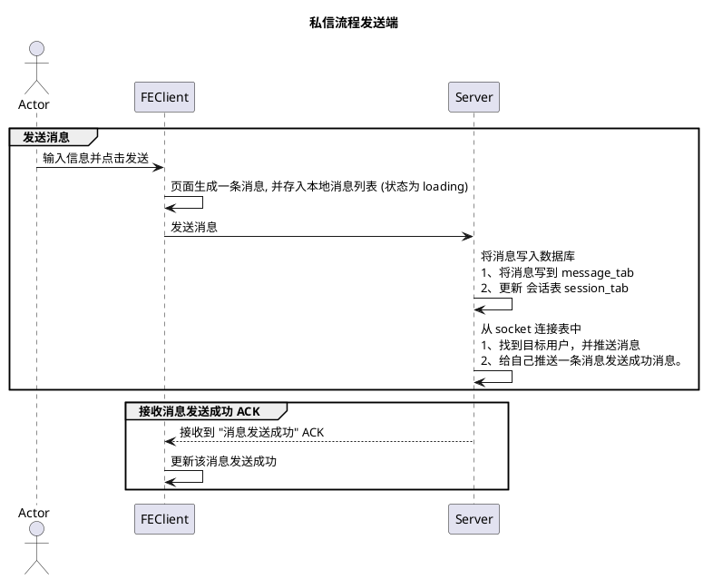
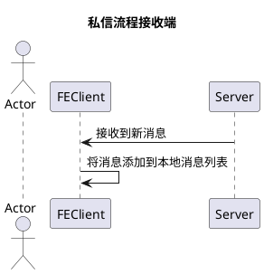

## 1、私信时序图





## 2、私信 API 参数

```ts
// 指令类型枚举
export enum CmdEnum {
  // 发送私信
  private_chat = 0,

  // 发送群消息
  group_chat = 1
}

// 消息类型枚举
export enum MsgTypeEnum {
  // 文本消息
  text = 0

  // 图片消息
  picture = 1
}

// 客户端发送消息 参数
export interface IMessagePayload {
  // 指令类型
  cmd: CmdEnum;

  // 接收者 id (room_id or user_id)
  rid: number;

  // 消息内容
  content: string;

  // 消息编号(客户端生成)
  msg_no: string;
}
```
